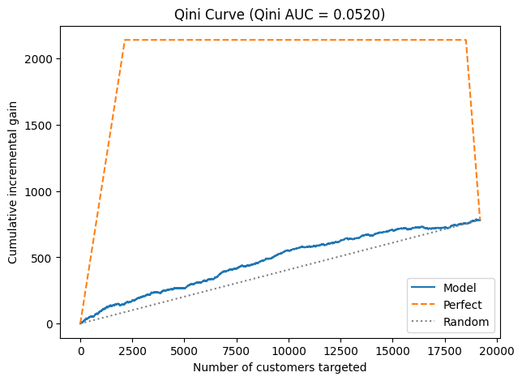
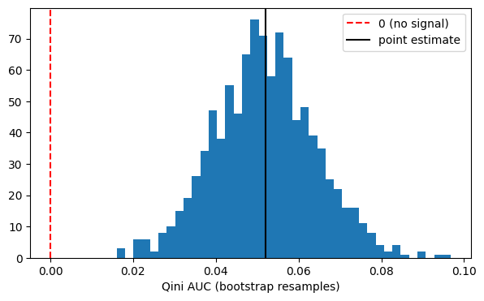
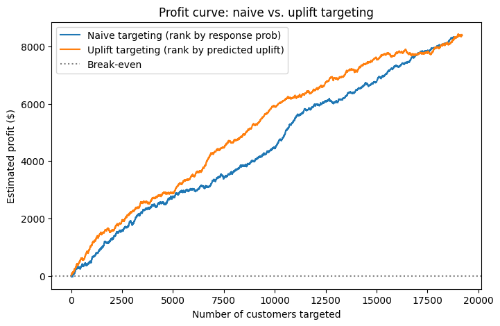

# Who Does the Email Actually Move? — An Uplift Retrospective on the Hillstrom Campaign

A retrospective diagnostic of a real email marketing RCT. The question is not "did the
campaign work" — a difference in means answers that. The question is whether the campaign's
*heterogeneity* contains a transferable pattern: something about who the email moves that
would let the next campaign be targeted rather than blanket.

**Headline finding:** the heterogeneity is real, statistically detectable, and interpretable —
women's-merchandise buyers respond nearly twice as strongly as everyone else — and an uplift
ranking beats a conventional response ranking at any fixed send budget. But the model finds no
customer the email actually *hurts*, so when the marginal cost of a send is near zero, the
profit-maximizing action is still "email everyone," and the ranking stops mattering. **Uplift
modeling's value here is conditional on a budget constraint existing at all.** Absent one, it
earns its keep as a diagnostic about who the brand resonates with, not as a suppression gate.

---

## 1. Background and Business Question

### The dataset

The [MineThatData E-Mail Analytics And Data Mining Challenge](https://blog.minethatdata.com/2008/03/minethatdata-e-mail-analytics-and-data.html)
dataset (Kevin Hillstrom, 2008): 64,000 customers who had purchased from a retailer within the
prior twelve months, loaded via `sklift.datasets.fetch_hillstrom`.

### The experimental design

Customers were randomly assigned in equal thirds to one of three arms:

| Arm | n | Visit rate (2 weeks) |
|---|---|---|
| Mens E-Mail | 21,307 | 18.28% |
| Womens E-Mail | 21,387 | 15.14% |
| No E-Mail (control) | 21,306 | 10.62% |

This is a genuine randomized controlled trial, not an observational dataset with a treatment
label bolted on. That matters: every causal claim below rests on random assignment, not on a
selection-on-observables assumption that would need defending.

The main analysis collapses the two email arms into a single `treatment = 1` ("any email",
n = 42,694) against `treatment = 0` ("no email", n = 21,306). This deliberately trades away the
"which creative for whom" question in order to answer the "whether to send at all" question
cleanly with roughly twice the treated sample. Section 3 argues that this trade may have been
the wrong side of the coin — see *What this analysis gave up*.

### Outcome: `visit`, not `conversion`

The dataset offers three outcomes — `visit`, `conversion`, and `spend`. This analysis uses
`visit` (did the customer visit the website in the two weeks following the send).

The reason is statistical power. Radcliffe & Surry's own volume rule of
thumb for uplift work is that *uplift × arm size ≥ 500* before a segment-level effect is
reliably detectable. Applying that rule to this data:

| Outcome | Base rate (control) | Verdict |
|---|---|---|
| `conversion` | 0.57% | ~100 against a ~500 threshold — badly underpowered |
| `visit` | 10.62% | ~1,000+ — clears comfortably |

Modeling uplift on `conversion` here would produce a model whose segment-level estimates are
mostly noise. `visit` is the weaker business proxy but the only outcome this experiment is
actually powered to resolve, and the profit translation in Section 3 carries an explicit
dollar value per visit to bridge the gap. Choosing the outcome you can measure over the outcome
you want is a real constraint in marketing analytics, and it is stated here rather than buried.

### What this analysis is (and is not)

It is **not** an attempt to ship a model artifact. It **is** a retrospective diagnostic. Given a campaign that has already been sent, it asks:

1. Did the randomization actually hold, so that everything downstream is trustworthy?
2. Is there heterogeneity in who the email moved — and is it a *pattern*, or noise?
3. Does an uplift model separate **persuadables** (visit *because* of the email) from
   **sure things** (would have visited anyway) well enough to change a targeting decision —
   and is that separation worth money?

---

## 2. Analysis Approach

### Step 1 — Validate the randomization

Random assignment is the load-bearing assumption. A real RCT can still come out imbalanced by
chance, and if it did, every effect estimate downstream would be contaminated. All eight
pre-treatment covariates were tested for balance between the collapsed arms — Welch's t-test
for continuous covariates (unequal variances not assumed away), chi-square for binary and
categorical ones.

Testing eight covariates at once inflates the false-positive rate, so the threshold was
Bonferroni-adjusted to α = 0.05 / 8 = 0.00625.

| Covariate | Test | p-value | Imbalanced |
|---|---|---|---|
| recency | Welch t | 0.474 | No |
| history | Welch t | 0.398 | No |
| mens | chi-square | 0.436 | No |
| womens | chi-square | 0.460 | No |
| newbie | chi-square | 0.927 | No |
| channel | chi-square | 0.840 | No |
| zip_code | chi-square | 0.533 | No |
| history_segment | chi-square | 0.505 | No |

Nothing is close to the threshold — the smallest p-value is 0.398. The randomization holds, and
the causal interpretation below is clean.

**Overall ATE:** treated 16.70% vs. control 10.62% — a **+6.09 percentage point** lift, a ~57%
relative increase in visit rate. The campaign unambiguously worked in aggregate. The rest of
this analysis is about whether that average conceals a usable pattern.

### Step 2 — Look for heterogeneity before modeling it

Before fitting anything, uplift was computed directly as a treated-minus-control difference
within each observed segment. This is the honest first move: if simple subgroup differences
show no structure, a model that claims to find some is probably fitting noise.

| Segment | Uplift (pp) |
|---|---|
| **Bought women's merchandise** | **+7.78** |
| Did not buy women's merchandise | +4.00 |
| Did **not** buy men's merchandise | +7.23 |
| Bought men's merchandise | +5.17 |
| Spend history, top quartile ($326+) | +6.95 |
| Spend history, bottom three quartiles | +5.67 to +5.83 |
| Recency (1 to 12 months) | +5.69 to +6.62 (flat) |
| Urban / Suburban / Rural | +6.33 / +6.15 / +5.15 |
| Newbie vs. established | +6.28 / +5.90 (flat) |
| Multichannel / Web / Phone | +6.50 / +6.07 / +5.99 (flat) |

One axis dominates: **women's-merchandise purchase history**, where the response is nearly
double (7.78pp vs. 4.00pp). Prior spend contributes a milder gradient. Recency, newbie status,
and channel — the variables a marketer's intuition usually reaches for first — are essentially
flat on *uplift*, even though recency is strongly predictive of visiting at all. That gap
between "predicts response" and "predicts incremental response" is the entire premise of uplift
modeling, and it shows up here in the raw data before any model is fit.

### Step 3 — Model choice

Data was split 70/30 (44,800 / 19,200), stratified on the treatment × outcome cross so that
both arms and both outcome classes are proportionally represented in each split. All
preprocessing was fit on train only.

Features are the eight pre-treatment covariates, one-hot encoded to nine columns.
`history_segment` was dropped as a binned duplicate of `history`; `customer_id` and all
post-treatment outcomes were excluded as label and leakage respectively.

A **T-learner** was chosen as the primary method — one outcome model per arm, with uplift as
the difference in their predicted probabilities. With 42,694 treated and 21,306 control
observations, both arms are large enough to support independent models, and the T-learner's
main weakness (it cannot borrow strength across arms when one is small) does not bite here.

Base learner selection was run as an explicit comparison rather than assumed, using 5-fold
cross-validated ROC-AUC within each arm:

| Arm | Logistic regression | Random forest |
|---|---|---|
| Control | **0.647** | 0.569 |
| Treated | **0.620** | 0.539 |

Logistic regression wins clearly in both arms. With only nine features, no meaningful
interactions visible in Step 2, and a noisy binary outcome, the random forest has room to
overfit and nothing structural to gain. Uplift is a *difference* of two model outputs, which
means it inherits the variance of both — so a base learner that overfits is doubly damaging.
The simpler model is the right one here, and the comparison is reported rather than the
result silently presented as a choice.

Regularization strength was tuned per arm by grid search (C ∈ {0.001 … 100}); both arms
selected C = 100.

### Step 4 — Does the model rank anyone correctly?

The predicted uplift distribution across the held-out test set:

| | Value |
|---|---|
| Mean | +6.01pp |
| Median | +6.06pp |
| Std. dev. | 1.95pp |
| Min | **−2.39pp** |
| Max | +10.98pp |

Two things stand out. First, the mean predicted uplift (6.01pp) lands almost exactly on the
experimentally measured ATE (6.09pp) — a basic calibration sanity check the model passes.

Second, and more consequentially: **the predicted uplift is almost entirely positive.** The
minimum across 19,200 customers is −2.39pp, and only a sliver of the distribution falls below
zero. There is no meaningful population of "sleeping dogs" — customers the email actively
drives away. This single fact does more to shape the recommendation than anything else in the
analysis, and it is returned to in Section 3.

**Qini AUC = 0.0520**, with a 1,000-resample bootstrap 95% CI of **[0.0286, 0.0762]** — excludes
zero. (AUUC = 0.0309.) The ranking signal is real, not an artifact of a lucky split.



The model curve sits consistently above the random-targeting diagonal across the full range —
but also far below the perfect-ranking ceiling, which peaks at roughly 2,140 incremental visits
against the model's ~800 at full send. Real signal, modest magnitude. That is the honest read,
and the bootstrap distribution confirms the effect is distinguishable from zero rather than
merely positive-looking:



### Step 5 — Where does uplift disagree with the naive approach?

The naive approach — the genuinely tempting one, and the one most response models in production
actually implement — ranks customers by *probability of visiting if emailed* (`μ₁` alone). It
optimizes for response, not for incremental response. The uplift ranking uses `μ₁ − μ₀`.

Both rankings come from the same fitted models, asking different questions. Their Spearman rank
correlation is **0.528** — related, but far from interchangeable. At a top-20% targeting budget
(3,840 customers), they overlap on 2,430 (63.3%) and disagree on 1,410 in each direction.

Those two disagreement groups are where the method proves itself or doesn't:

| | "Sure things" (naive targets, uplift skips) | "Persuadables" (naive skips, uplift targets) |
|---|---|---|
| Mean prior spend | $404 | $207 |
| Mean recency (months) | 3.4 | 4.4 |
| Bought women's merchandise | 67.6% | **100%** |
| Bought men's merchandise | 46.7% | 15.0% |
| Dominant zip | Rural (66%) | Urban (61%) |
| Dominant channel | Web | Phone |
| **Measured uplift (held-out)** | **+3.04pp** | **+5.10pp** |
| 95% bootstrap CI | [−1.63pp, +7.37pp] | [+1.43pp, +8.96pp] |
| Excludes zero | **No** | **Yes** |

This is the closest thing to a validation that real data permits — there is no ground-truth
individual treatment effect to check against, so the test has to be whether the model's
*disagreements* pay off when measured experimentally.

They do, directionally. The customers uplift **drops** are high-value, recent, heavy-spending
Rural Web buyers who were going to visit anyway — the textbook "sure thing" profile — and their
measured incremental effect is not statistically distinguishable from zero. The customers uplift
**adds** are uniformly women's-merchandise buyers with half the spend history, reached by phone,
in urban zips, and their incremental effect is significant. The model is trading customers who
look valuable for customers who are actually movable, which is exactly what it is supposed to do.

**The honest caveat:** those two confidence intervals overlap substantially. The point estimates
favor the uplift ranking (5.10pp vs. 3.04pp), and only the persuadable group's interval excludes
zero — but the *difference between the two groups* is not itself statistically significant at
these sample sizes (~1,400 per group, split roughly 2:1 treated:control). This is suggestive
evidence that the uplift ranking is picking up something real, consistent with the Qini result,
and it should not be oversold as proof.

### Step 6 — Translate to money

Ranking quality only matters if it changes a decision, and decisions are made in dollars.

**Stated assumptions:**

| Parameter | Value | Basis |
|---|---|---|
| Value per visit | **$7.16** | *(derivation to be documented — see note below)* |
| Cost per send | **$0.00** | Marginal cost of an incremental email is operationally negligible |

> **Note:** the $7.16 per-visit value is currently asserted rather than shown. The `spend`
> column in the dataset supports deriving it directly (incremental spend per incremental
> visit), and that derivation belongs in the notebook. The cost-per-send assumption is
> discussed critically in Section 3 — it is the single most consequential number in this
> analysis, and it is almost certainly wrong in a way that matters.



| Strategy | Optimal number targeted | Max estimated profit |
|---|---|---|
| Naive (rank by response probability) | 19,186 of 19,200 | $8,394.35 |
| Uplift (rank by predicted uplift) | 19,024 of 19,200 | $8,427.80 |
| **Difference** | | **$33.45** |

Read the table alone and the conclusion is that uplift modeling bought $33 on $8,400 — a 0.4%
improvement, a rounding error. But the table and the chart tell different stories, and the
chart is the more useful one.

**Both strategies peak at essentially a full send.** Because the marginal cost of a send is
assumed to be zero, every additional email has non-negative expected value, so the profit curve
climbs until the list is exhausted. The optimum is "email everyone," and at "email everyone"
the ranking is irrelevant by construction — both strategies have selected the same people. The
$33.45 gap is measured at a point where targeting has been defined out of existence.

**The curve away from that point is where the value lives.** The uplift curve sits above the
naive curve across essentially the entire budget range, and the separation is widest in the
middle of the list: at a roughly half-list send (~10,000 customers), uplift targeting is ahead
by on the order of $1,500 — not $33. The two converge only as both approach a full send, which
is precisely the regime in which the ranking cannot matter.

The correct reading, then, is conditional: **uplift targeting is clearly better than naive
targeting whenever a budget or capacity constraint binds, and worth nothing when it doesn't.**

---

## 3. Marketing Recommendations

### 1. Keep emailing broadly. Do not build an uplift gate on this evidence.

At a marginal send cost near zero and with no meaningful negative-uplift population, the
profit-optimal policy for a campaign like this one is a full send. The model looked hard for
customers the email drives away and did not find them — the minimum predicted uplift across
19,200 held-out customers is −2.39pp, and the distribution is overwhelmingly positive.

This is worth saying plainly because it is the opposite of what an uplift project is expected to
conclude. A suppression list is the deliverable everyone anticipates. The data does not support
one. Echoing Farahat & Bailey's conclusion in a different advertising context — more
sophisticated targeting here would not gain, and by shrinking reach for no incremental benefit,
could cost.

**The exception, and it is an important one:** if a send budget or contact-frequency cap *does*
bind — a limited campaign slot, a capped weekly contact policy, a paid channel — then rank by
predicted uplift, not by predicted response. At a half-list budget that choice is worth roughly
$1,500 per 19,200 customers on these assumptions. The recommendation is not "the model is
useless," it is "the model only changes the decision when something forces you to choose."

### 2. The moment send cost stops being zero, revisit this immediately.

This recommendation is entirely contingent on the cost assumption, and that assumption is the
weakest link in the analysis. The true cost of an email is not the fraction of a cent of
delivery — it is **list fatigue, unsubscribes, and deliverability damage**, none of which this
dataset can see. The observation window is two weeks and the outcomes are `visit`, `conversion`,
and `spend`. There is no unsubscribe outcome and no long-run engagement measure.

So the model says "email everyone" partly because the dataset is blind to the cost that actually
constrains real email programs. That is a limitation of the evidence, not a finding about the
world.

**Concrete next step:** run the profit curve as a sensitivity analysis across a range of
cost-per-send values and find the break-even point at which uplift targeting begins to beat a
full send by a margin worth operating. Given the shape of the profit curve, that crossover
should arrive at a strikingly low cost per send. That number — *"targeting starts paying at
$X per send"* — is the single most decision-useful output this analysis could produce, and it
is a small computation on work already done.

### 3. Use the heterogeneity as a brand diagnostic, not a targeting rule.

The strongest, most stable pattern in the data is that **women's-merchandise buyers respond
nearly twice as strongly to email as everyone else** (+7.78pp vs. +4.00pp), and that this holds
up under modeling — the model's persuadable group is 100% women's-merchandise buyers. Prior
spend adds a secondary gradient. Recency, tenure, and channel are strongly predictive of
visiting but nearly useless for predicting *incremental* visiting.

That last point is the transferable lesson. A marketing team that ranks its list by "most likely
to engage" is systematically selecting customers who were going to engage anyway — the sure-
things group here had a measured incremental effect statistically indistinguishable from zero
despite being the naive model's top picks. The pattern is worth carrying into campaign design,
creative allocation, and how future tests are structured, even where it is not worth carrying
into a send/suppress rule.

### 4. The higher-value question is *which* email, not *whether*.

The two email arms performed differently: Mens E-Mail drove an 18.28% visit rate against Womens
E-Mail's 15.14%. Collapsing them — which this analysis did, deliberately, to gain power on the
whether-to-send question — averages that difference away.

Sitting next to the finding that women's-merchandise buyers are the most responsive segment,
this is a genuinely interesting tension and the most promising direction for follow-up work. If
the incremental gain from deciding *whether* to send is near zero because sending is nearly
free, then the remaining lever is *what to send*, which costs the same either way. A three-arm
uplift analysis estimating creative-specific effects per customer is where the next dollar of
analytical effort should go.


### Confidence

Moderate-to-high in the aggregate causal claim (clean RCT, balanced arms, large samples,
+6.09pp). Moderate in the heterogeneity pattern (Qini CI excludes zero; the persuadable/sure-
thing split validates directionally out-of-sample, but the two groups' intervals overlap).
Low-to-moderate in the dollar figures, which inherit an unverified per-visit value and an
almost certainly understated send cost.

---

## 4. Repo Structure

```
.
├── README.md                 # This write-up
├── uplift_modeling.ipynb     # Full analysis: EDA → balance checks → T-learner → Qini → profit
├── column_definitions.md     # Data dictionary and outcome-choice rationale
└── figures/                  # Charts extracted from the notebook for this write-up
    ├── qini_curve.png
    ├── qini_bootstrap.png
    └── profit_curve.png
```

**Reproducing:** the notebook runs top to bottom with no local data files. The dataset is
fetched at runtime via `sklift.datasets.fetch_hillstrom`. Requires `pandas`, `numpy`, `scipy`,
`scikit-learn`, `scikit-uplift`, and `matplotlib`. All random operations are seeded
(`random_state=42`, bootstrap `default_rng(42)`).

---

## 5. Data

64,000 customers, each with eight pre-treatment covariates, a randomized treatment assignment,
and three post-treatment outcomes. Full definitions in
[column_definitions.md](column_definitions.md).

**Pre-treatment features (X)**

| Column | Definition |
|---|---|
| `recency` | Months since the customer's last purchase |
| `history` | Dollar amount spent in the past year |
| `history_segment` | Binned version of `history` (dropped from modeling as redundant) |
| `mens` | 1 if the customer purchased men's merchandise in the past year |
| `womens` | 1 if the customer purchased women's merchandise in the past year |
| `zip_code` | Urban / Suburban / Rural |
| `newbie` | 1 if the customer joined in the last 12 months |
| `channel` | Phone / Web / Multichannel |

**Treatment**

| Column | Definition |
|---|---|
| `segment` | Randomly assigned arm: Mens E-Mail / Womens E-Mail / No E-Mail |
| `treatment` | Derived: 1 if either email arm, 0 if No E-Mail |

**Outcomes (post-treatment — never used as features)**

| Column | Definition |
|---|---|
| `visit` | 1 if the customer visited the website within two weeks — **outcome used here** |
| `conversion` | 1 if the customer purchased within two weeks — excluded on power grounds |
| `spend` | Dollars spent within two weeks — not used |

---

## 6. References

- Künzel, Sekhon, Bickel & Yu (2019) — *Metalearners for Estimating Heterogeneous Treatment
  Effects Using Machine Learning*
- Radcliffe & Surry — *Real-World Uplift Modelling with Significance-Based Uplift Trees*
- Diemert, Betlei, Renaudin & Amini — *A Large Scale Benchmark for Uplift Modeling*
- He, Shu, Qu, Gao et al. — *CanniUplift: A Holistic Framework for Mitigating Seller and
  Incentive Cannibalization in E-commerce Uplift Modeling*
