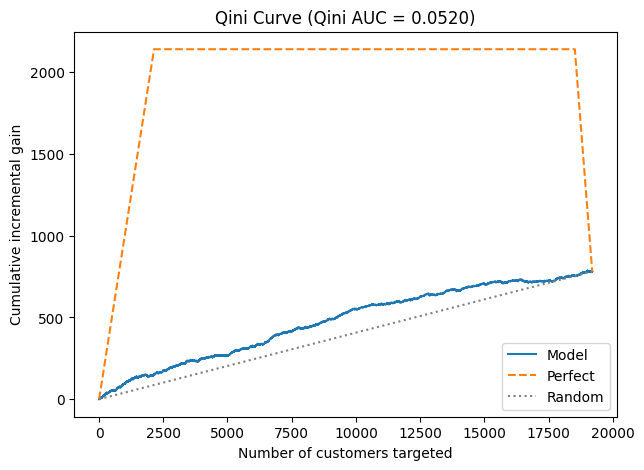
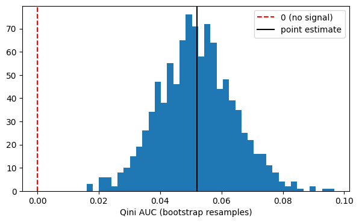
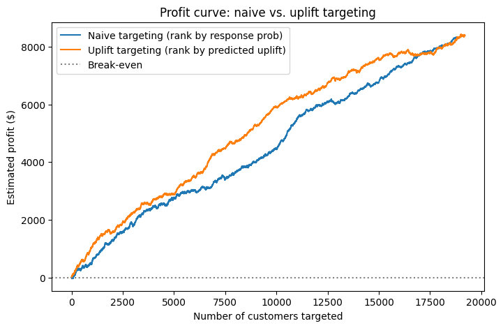

# Who Does the Email Actually Move? — An Uplift Retrospective on the Hillstrom Campaign

A retrospective diagnostic of a real email marketing RCT. The campaign has already run, the
goal is to evaluate the email at the **customer
level**. Who did this particular send actually move? Is there any transferable pattern to guide targeting for future campaigns of the same kind?

**Headline finding:** the heterogeneity is real, statistically detectable, and interpretable —
women's-merchandise buyers respond nearly twice as strongly as everyone else. But it does not
translate into money. The model
finds no customer the email hurts, so there is nobody to suppress, and at a near-zero cost per
send the profit-maximizing action remains "email everyone."

---

## 1. Background

### The dataset

The [MineThatData E-Mail Analytics And Data Mining Challenge](https://blog.minethatdata.com/2008/03/minethatdata-e-mail-analytics-and-data.html)
dataset: 64,000 customers who had purchased from a retailer within the
prior twelve months, loaded via `sklift.datasets.fetch_hillstrom`.

### The Experiment

Customers were randomly assigned in equal thirds to one of three arms:

| Arm | n | Visit Rate (2 weeks) |
|---|---|---|
| Mens E-Mail | 21,307 | 18.28% |
| Womens E-Mail | 21,387 | 15.14% |
| No E-Mail (control) | 21,306 | 10.62% |


### Outcome: `visit`

This analysis models `visit` — did the customer visit the website in the two weeks after the
send?

The dataset offers three outcomes, and the choice between them comes down to statistical power.
Uplift is a difference between two group rates, so it needs a common enough outcome for that
difference to be measurable rather than noise:

- **`conversion`** fires for only 0.57% of control customers. At that base rate, segment-level
  uplift estimates are mostly noise.
- **`spend`** is continuous, but heavily zero-inflated and right-skewed, so a handful of large
  orders would dominate the variance.
- **`visit`** has a 10.62% control base rate, less noisy.

The tradeoff: `visit` is the furthest of the three from revenue, so it
is the weakest business proxy of the set.

### From business question to testable questions

1. Did the randomization actually hold, so that everything downstream is trustworthy?
2. Is there heterogeneity in who the email moved — and is it a pattern, or noise?
3. Does an uplift model separate **persuadables** (visit because of the email) from
   **sure things** (would have visited anyway) well enough to change a targeting decision —
   and is that separation worth money?
4. Does the email hurt anyone — a **sleeping dogs** segment with negative uplift that should
   be suppressed regardless of budget?

---

## 2. Analysis Approach

### Randomization Check

Random assignment is the load-bearing assumption. A real RCT can still come out imbalanced by
chance, and if it did, every effect estimate downstream would be contaminated. All eight
pre-treatment covariates were tested for balance between the collapsed arms — Welch's t-test
for continuous covariates, chi-square for binary and
categorical ones.

Testing eight covariates at once inflates the false-positive rate, so the threshold was
Bonferroni-adjusted to α = 0.05 / 8 = 0.00625.

| Covariate | Test | p-value | Imbalanced |
|---|---|---|---|
| recency | Welch t | 0.474 | No |
| history | Welch t | 0.398 | No |
| mens | chi-square | 0.436 | No |
| womens | chi-square | 0.460 | No |
| newbie | chi-square | 0.927 | No |
| channel | chi-square | 0.840 | No |
| zip_code | chi-square | 0.533 | No |
| history_segment | chi-square | 0.505 | No |

The randomization holds, and
the causal interpretation below is clean.

**Overall ATE:** treated 16.70% vs. control 10.62% — a **+6.09 percentage point** lift, a ~57%
relative increase in visit rate. The campaign unambiguously worked in aggregate. 

### Heterogeneity

If simple subgroup differences show no structure, a model that claims to find some is probably fitting noise.

| Segment | Uplift (pp) |
|---|---|
| Bought women's merchandise | **+7.78** |
| Did not buy women's merchandise | +4.00 |
| Did not buy men's merchandise | +7.23 |
| Bought men's merchandise | +5.17 |
| Spend history, top quartile ($326+) | +6.95 |
| Spend history, bottom three quartiles | +5.67 to +5.83 |
| Recency (1 to 12 months) | +5.69 to +6.62 (flat) |
| Urban / Suburban / Rural | +6.33 / +6.15 / +5.15 |
| Newbie vs. established | +6.28 / +5.90 (flat) |
| Multichannel / Web / Phone | +6.50 / +6.07 / +5.99 (flat) |


### Model choice

Data was split 70/30 (44,800 / 19,200), stratified on the treatment × outcome cross so that
both arms and both outcome classes are proportionally represented in each split. 

A **T-learner** was chosen as the primary method — one outcome model per arm, with uplift as
the difference in their predicted probabilities. With 42,694 treated and 21,306 control
observations, both arms are large enough to support independent models. It was chosen for its
simplicity in extracting the difference; its limitation is that each arm's model never learns
from the other arm's data. As an extension, the X-learner is the natural next step, it borrows
strength across arms when they are unbalanced with the S-learner worth fitting as a simpler contrast (Künzel et al. 2019).

Base learner selection was run as an explicit comparison between traditional logistic regression and tree based model, using 5-fold
cross-validated ROC-AUC within each arm:

| Arm | Logistic regression | Random forest |
|---|---|---|
| Control | **0.647** | 0.569 |
| Treated | **0.620** | 0.539 |

Logistic regression wins in both arms. Uplift is a difference of two model outputs, which
means it inherits the variance of both, so the simpler model is the right one here.

### Does the model rank anyone correctly?

The mean predicted uplift (6.01pp) lands almost exactly on the
experimentally measured ATE (6.09pp) — a basic calibration sanity check the model passes.

Additionally, the predicted uplift is almost entirely positive. The
minimum across 19,200 customers is −2.39pp, and only a sliver of the distribution falls below
zero. There is no meaningful population of "sleeping dogs" — customers the email actively
drives away. 

**Qini AUC = 0.0520**, with a 1,000-resample bootstrap 95% CI of **[0.0286, 0.0762]** — excludes
zero. (AUUC = 0.0309.) The ranking signal is real, not an artifact of a lucky split.



The model curve sits consistently above the random-targeting diagonal across the full range. Real signal, modest magnitude. That is the honest read,
and the bootstrap distribution confirms the effect is distinguishable from zero rather than
merely positive-looking:



### Where does uplift disagree with the naive approach?

The naive approach — the genuinely tempting one, and the one most response models in production
actually implement — ranks customers by probability of visiting if emailed (`μ₁` alone). It
optimizes for response, not for incremental response. The uplift ranking uses `μ₁ − μ₀`.

Their Spearman rank correlation is **0.528** — related, but far from interchangeable. At a top-20% targeting budget
(3,840 customers), they overlap on 2,430 (63.3%) and disagree on 1,410 in each direction.

Below are the two disagreement groups:

| | "Sure things" (naive targets, uplift skips) | "Persuadables" (naive skips, uplift targets) |
|---|---|---|
| Mean prior spend | $404 | $207 |
| Mean recency (months) | 3.4 | 4.4 |
| Bought women's merchandise | 67.6% | **100%** |
| Bought men's merchandise | 46.7% | 15.0% |
| Dominant zip | Rural (66%) | Urban (61%) |
| Dominant channel | Web | Phone |
| **Measured uplift (held-out)** | **+3.04pp** | **+5.10pp** |
| 95% bootstrap CI | [−1.63pp, +7.37pp] | [+1.43pp, +8.96pp] |
| Excludes zero | **No** | **Yes** |


The customers uplift drops are high-value, recent, heavy-spending
Rural Web buyers who were going to visit anyway — the textbook "sure thing" profile — and their
measured incremental effect is not statistically distinguishable from zero. The customers uplift
adds are uniformly women's-merchandise buyers with half the spend history, reached by phone,
in urban zips, and their incremental effect is significant. Those two confidence intervals overlap substantially. The point estimates favor the uplift ranking (5.10pp vs. 3.04pp), and only the persuadable group's interval excludes zero — but the difference between the two groups is not itself statistically significant at these sample sizes (~1,400 per group, split roughly 2:1 treated:control). This is suggestive evidence that the uplift ranking is picking up something real, consistent with the Qini result.

### Translate to money

**Stated assumptions:**

| Parameter | Value | Basis |
|---|---|---|
| Value per visit | **$7.16** | Derived from the `spend` column in the dataset |
| Cost per send | **$0.00** | Marginal cost of an incremental email is operationally negligible |




| Strategy | Optimal number targeted | Max estimated profit |
|---|---|---|
| Naive (rank by response probability) | 19,186 of 19,200 | $8,394.35 |
| Uplift (rank by predicted uplift) | 19,024 of 19,200 | $8,427.80 |
| **Difference** | | **$33.45** |

Read the table alone and the conclusion is that uplift modeling bought $33 on $8,400 — a 0.4%
improvement, a rounding error. 
**Both strategies peak at essentially a full send.** Because the marginal cost of a send is
assumed to be zero, every additional email has non-negative expected value, so the profit curve
climbs until the list is exhausted. The optimum is "email everyone," and at "email everyone"
the ranking is irrelevant by construction — both strategies have selected the same people. 

The uplift curve sits above the naive curve across essentially the entire budget range, and the separation is widest in the middle of the list: at a roughly half-list send (~10,000 customers).Uplift targeting is clearly better than naive
targeting whenever a budget or capacity constraint binds. 

---

## 3. Marketing Recommendations

### 1. Keep emailing broadly. Do not build an uplift gate on this evidence.

At a marginal send cost near zero and with no meaningful negative-uplift population, the
profit-optimal policy for a campaign like this one is a full send. The model looked hard for
customers the email drives away and did not find them — the minimum predicted uplift across
19,200 held-out customers is −2.39pp, and the distribution is overwhelmingly positive.


### 2. The moment send cost stops being zero, revisit this immediately.

This recommendation is entirely contingent on the cost assumption, and that assumption is the
weakest link in the analysis. So the model says "email everyone" partly because the dataset is blind to the cost that actually
constrains real email programs. That is a limitation of the evidence, not a finding about the
world.

**Concrete next step:** run the profit curve as a sensitivity analysis across a range of
cost-per-send values and find the break-even point at which uplift targeting begins to beat a
full send by a margin worth operating. Given the shape of the profit curve, that crossover
should arrive at a strikingly low cost per send.

### 3. Use the heterogeneity as a brand diagnostic.

The strongest, most stable pattern in the data is that **women's-merchandise buyers respond
nearly twice as strongly to email as everyone else** (+7.78pp vs. +4.00pp), and that this holds
up under modeling — the model's persuadable group is 100% women's-merchandise buyers. Prior
spend adds a secondary gradient. Recency, tenure, and channel are strongly predictive of
visiting but nearly useless for predicting incremental visiting.

That last point is the transferable lesson. A marketing team that ranks its list by "most likely
to engage" is systematically selecting customers who were going to engage anyway — the sure-
things group here had a measured incremental effect statistically indistinguishable from zero
despite being the naive model's top picks. The pattern is worth carrying into campaign design,
creative allocation, and how future tests are structured, even where it is not worth carrying
into a send/suppress rule.

---

## 4. Repo Structure

```
.
├── README.md                 # This write-up
├── uplift_modeling.ipynb     # Full analysis: EDA → balance checks → T-learner → Qini → profit
├── column_definitions.md     # Data dictionary and outcome-choice rationale
└── figures/                  # Charts extracted from the notebook for this write-up
    ├── qini_curve.png
    ├── qini_bootstrap.png
    └── profit_curve.png
```


---

## 5. Data

64,000 customers, each with eight pre-treatment covariates, a randomized treatment assignment,
and three post-treatment outcomes. Full definitions in
[column_definitions.md](column_definitions.md).

**Pre-treatment features (X)**

| Column | Definition |
|---|---|
| `recency` | Months since the customer's last purchase |
| `history` | Dollar amount spent in the past year |
| `history_segment` | Binned version of `history` (dropped from modeling as redundant) |
| `mens` | 1 if the customer purchased men's merchandise in the past year |
| `womens` | 1 if the customer purchased women's merchandise in the past year |
| `zip_code` | Urban / Suburban / Rural |
| `newbie` | 1 if the customer joined in the last 12 months |
| `channel` | Phone / Web / Multichannel |

**Treatment**

| Column | Definition |
|---|---|
| `segment` | Randomly assigned arm: Mens E-Mail / Womens E-Mail / No E-Mail |
| `treatment` | Derived: 1 if either email arm, 0 if No E-Mail |

**Outcomes (post-treatment — never used as features)**

| Column | Definition |
|---|---|
| `visit` | 1 if the customer visited the website within two weeks — **outcome used here** |
| `conversion` | 1 if the customer purchased within two weeks — excluded on power grounds |
| `spend` | Dollars spent within two weeks — not used |

---

## 6. References

- Künzel, Sekhon, Bickel & Yu (2019) — *Metalearners for Estimating Heterogeneous Treatment
  Effects Using Machine Learning*
- Radcliffe & Surry — *Real-World Uplift Modelling with Significance-Based Uplift Trees*
- Diemert, Betlei, Renaudin & Amini — *A Large Scale Benchmark for Uplift Modeling*
- He, Shu, Qu, Gao et al. — *CanniUplift: A Holistic Framework for Mitigating Seller and
  Incentive Cannibalization in E-commerce Uplift Modeling*
